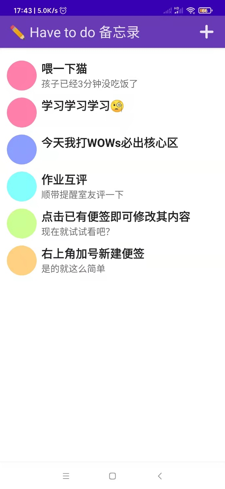
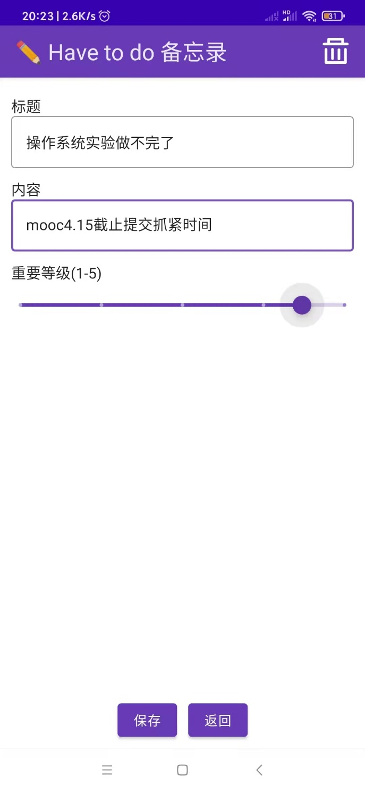

# Have-to-do-Android

方维维《移动应用开发》课程的作业1，源码供想要学习 Kotlin 的同学参考 / Fang Weiwei's assignment 1 of mobile application development, for people who want to learn Kotlin. 

传播请遵守 `GPL3.0` 协议（真的有人会用吗），严禁直接抄袭 (No cheating!)  

### 预览

|  |  |
| ------------------------------------------------- | ------------------------------------------------- |

